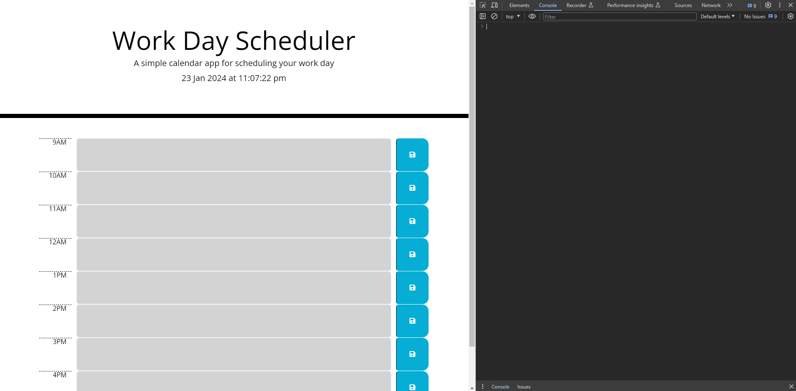

# Daily-Planner

Daily business hours planner

## Description

- A daily planner for business hours from 9am-5pm.
- At the top it will display the current date and the current time.
- You can type in your text in the time block available.
- If the current time block is the same hour as the current time it will highlight the time block in light red.
- If the time block is in the past of the current hour then it will highlight it grey.
- If the time is in the time block is in the future then it will highlight it green.
- After clicking the save button icon, it will save the input and store it in local storage.
- Upon page refresh whatever is inputted will not disappear providing the save icon button is clicked.
- You can delete what is saved by deleting the input text and clicking the save icon.

[GitHub page](https://github.com/Digita1Panda/daily-planner)

[Daily Planner](https://digita1panda.github.io/daily-planner/)

## Installation

N/A

## Usage

## Credits

N/A

## License

MIT License

Copyright & All rights Reserved (c) 2023 Kwok Law

Permission is hereby granted, free of charge, to any person obtaining a copy of this software and associated documentation files (the “Software”), to deal in the Software without restriction, including without limitation the rights to use, copy, modify, merge, publish, distribute, sublicense, and/or sell copies of the Software, and to permit persons to whom the Software is furnished to do so, subject to the following conditions:

The above copyright notice and this permission notice shall be included in all copies or substantial portions of the Software.

THE SOFTWARE IS PROVIDED “AS IS”, WITHOUT WARRANTY OF ANY KIND, EXPRESS OR IMPLIED, INCLUDING BUT NOT LIMITED TO THE WARRANTIES OF MERCHANTABILITY, FITNESS FOR A PARTICULAR PURPOSE AND NONINFRINGEMENT. IN NO EVENT SHALL THE AUTHORS OR COPYRIGHT HOLDERS BE LIABLE FOR ANY CLAIM, DAMAGES OR OTHER LIABILITY, WHETHER IN AN ACTION OF CONTRACT, TORT OR OTHERWISE, ARISING FROM, OUT OF OR IN CONNECTION WITH THE SOFTWARE OR THE USE OR OTHER DEALINGS IN THE SOFTWARE.

---

## Badges

## Features

N/A

## Contributing

## Tests

N/A

---

Copyright © 2023 K.Law All Rights Reserved.
